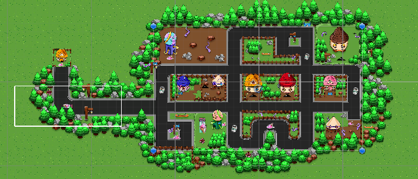

# 2D Package Delivery Game

A top-down 2D delivery game built in Unity. Drive through a pixel-art town, pick up packages, deliver them to monster-like customers, collect boost pads for speed, and avoid crashes.

---

## Screenshots & Gameplay

### Game Map Overview



---

### Boost Mechanic

https://github.com/user-attachments/assets/ef9261a4-1db0-4795-a92c-9d52a85c7d29

---

### Package Pickup & Delivery

https://github.com/user-attachments/assets/f06e91fb-bc2f-4326-883c-373d06ff85bd

---

## Project Structure

```
Assets/
│
├── Scripts/
│   ├── driver.cs         # Car movement, boost collision, speed control
│   └── colllisions.cs    # Package pickup, delivery logic, win condition
│
├── Scenes/               # Unity scene files
├── Sprites/              # Pixel-art assets
└── ...
```

---

## Features

- Top-down 2D driving with WASD controls
- Package pickup system with particle effects on collection
- Delivery system — bring packages to customers to complete orders
- Boost pads increase car speed on contact with a HUD indicator
- Collision penalty — hitting obstacles reduces speed
- Win condition triggers after 5 successful deliveries

---

## Controls

| Key | Action        |
|-----|---------------|
| W   | Move forward  |
| S   | Move backward |
| A   | Steer left    |
| D   | Steer right   |

---

## How It Works

**Boost**
When the car enters a trigger tagged `boost`, the speed increases from the default value to the boosted speed and a "Boost" label appears on screen. The boost object is then destroyed.

**Package Pickup**
When the car touches an object tagged `package`, a particle system plays and the package is marked as collected.

**Delivery**
When the car reaches a `customer` trigger while carrying a package, the particle system stops, the customer object is destroyed, and the delivery counter increments. At 5 deliveries the game over/win text appears.

**Collision Penalty**
On any physics collision, the speed drops to the penalty value and the boost indicator is hidden.

---

## Requirements

- Unity 2021.3 or higher
- TextMeshPro package (included in Unity)
- New Input System package

---

## Setup

1. Clone the repository.
2. Open the project in Unity.
3. Open the main scene from the `Scenes/` folder.
4. Press Play.

---

